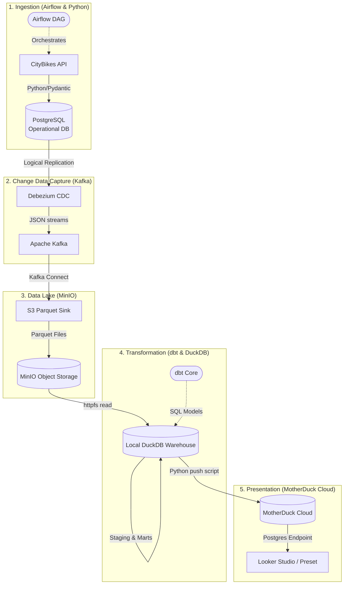

# CityBikes Modern Data Stack


## Overview
This project is an end-to-end data engineering pipeline that extracts real-time bike-sharing data from the [CityBikes API](http://api.citybik.es/v2/), stores it in a robust PostgreSQL database, captures changes via Debezium CDC, archives the data in a MinIO Data Lake as Parquet files, and transforms it into highly optimized analytical marts using DuckDB and dbt. Finally, these marts are synced to MotherDuck (cloud DuckDB) for lightning-fast BI dashboarding in tools like Looker Studio, Preset, or Hex.

All timestamps across the stack are strictly normalized to **UTC**.

## Architecture Diagram



## Tech Stack
* **Language / Environment:** Python 3.12, `uv`
* **Ingestion & Orchestration:** Apache Airflow, Pydantic, Requests
* **Operational Database:** PostgreSQL 16
* **Database Migrations:** Flyway
* **Change Data Capture (CDC):** Debezium, Apache Kafka
* **Data Lake (Archival Storage):** MinIO (S3 Compatible), Kafka Connect (Parquet Sink)
* **Data Warehouse / Analytics:** DuckDB, dbt (Data Build Tool)
* **Cloud BI Backend:** MotherDuck (Cloud DuckDB)
* **Containerization:** Docker Compose

## Quickstart

1. **Setup Environment:**
   ```bash
   cp .env.example .env
   # Ensure you add your MOTHERDUCK_TOKEN in .env!
   ```

2. **Start Infrastructure:**
   ```bash
   docker compose up -d --build
   ```

3. **Ingest Data:**
   Access Airflow at `http://localhost:8080` (User/Pass: `airflow`) and trigger `citybikes_ingestion_dag`.

4. **Enable CDC (Postgres -> Kafka):**
   ```bash
   curl -i -X POST -H "Accept:application/json" -H "Content-Type:application/json" \
   localhost:8083/connectors/ -d @cdc/register-postgres.json
   ```

5. **Enable Data Lake Sink (Kafka -> MinIO):**
   ```bash
   curl -i -X POST -H "Accept:application/json" -H "Content-Type:application/json" \
   localhost:8083/connectors/ -d @cdc/register-s3-sink.json
   ```

6. **Build Analytical Marts (dbt & DuckDB):**
   ```bash
   cd dbt_analytics
   uv run dbt run
   ```

7. **Sync to Cloud BI (MotherDuck):**
   ```bash
   uv run python push_to_motherduck.py
   ```
   *Your 10 analytical marts are now synced to MotherDuck's `public` schema and ready for Looker Studio, Preset, or any other BI tool!*

*See the `docs/` folder for more detailed architecture notes and command references.*
